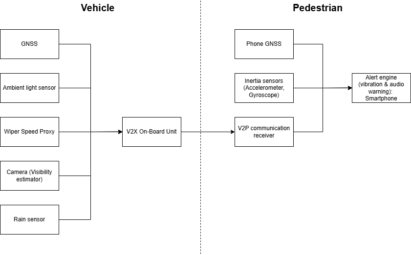
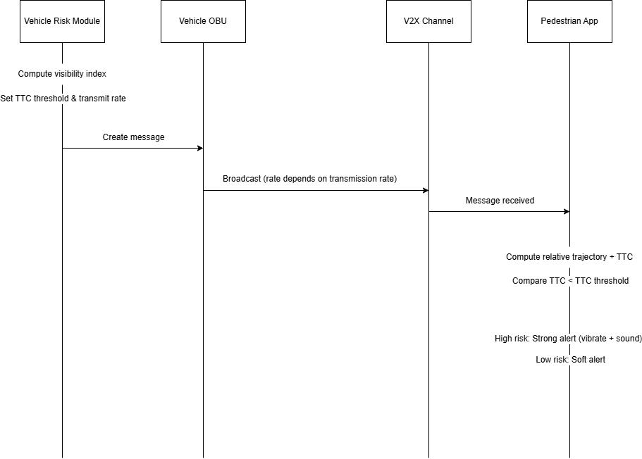

# Adaptive Visibility & Risk Scaling V2P System (AViRS-V2P)

---

# Project Overview

AViRS-V2P (Adaptive Visibility & Risk Scaling Vehicle-to-Pedestrian system) is a context-aware V2P communication system designed to improve pedestrian safety in **low-visibility conditions such as night, heavy rain, and fog**.

Traditional V2P systems typically rely on **fixed time-to-collision (TTC) thresholds and fixed broadcast rates**, which may not provide sufficient warning when environmental visibility deteriorates. At the same time, simply increasing message frequency can lead to **channel congestion and packet collisions** in vehicular networks.

Our proposed system introduces **adaptive communication and risk scaling**, where safety parameters and communication behaviour dynamically adjust based on environmental conditions and vehicle speed. The system computes a **Visibility Index** derived from ambient light levels, rain intensity (estimated through wiper activity), and fog detection from camera-based visibility estimation.

Using this index, AViRS-V2P dynamically adjusts:

* TTC thresholds
* Broadcast frequency
* Safety radius (alert distance)
* Alert intensity

This transforms V2P from a **static warning system into a context-aware adaptive communication protocol**, allowing safer operation while maintaining network efficiency.

---

# Literature Research

Vehicle-to-Pedestrian (V2P) communication is commonly proposed to protect vulnerable road users (VRUs) by broadcasting a vehicle’s motion state, for example, position, speed, heading, so that a pedestrian device can estimate collision risk. A key finding from the V2P literature is that real-world effectiveness is not determined only by the risk algorithm, but also by system-level constraints such as end-to-end latency, wireless reliability, positioning uncertainty, and scenario diversity, like different VRU types and pre-crash situations. This makes “one fixed rule” , for example a single Time-to-Collision threshold for every environment, difficult to justify across all conditions. (Sewalkar & Seitz, 2019)

From a standards perspective, ETSI’s VRU awareness work defines a VRU Awareness Basic Service and the VRU Awareness Message (VAM), including rules for when and how VRU-related information should be disseminated and how redundancy can be mitigated to reduce unnecessary channel usage. (ETSI, 2025) At the network/access layer, ITS-G5 includes Decentralized Congestion Control (DCC) mechanisms so that stations can adapt transmission behavior when the radio channel becomes busy, supporting “graceful degradation” rather than allowing uncontrolled beaconing to collapse reliability. (ETSI, 2024) ETSI technical studies further emphasize that congestion-control behavior and stability are critical because poor control can waste channel resources and reduce safety-message delivery when density is high.(ETSI, 2026)

Based on these insights, AViRS-V2P contributes a protocol-level adaptation layer that links (1) visibility-aware risk scaling by using a Visibility Index derived from light/rain/fog proxies, (2) adaptive TTC thresholds and adaptive broadcast rates, and (3) DCC-style backoff when the channel is busy. The intent is to provide earlier warnings under poor visibility without relying on “always-on high-rate” transmissions that can increase congestion and reduce overall network reliability. (ETSI, 2025)

Building on this, AViRS-V2P contributes a protocol-level adaptation layer that couples:

1. **Visibility-aware risk scaling** (via a Visibility Index derived from light/rain/fog proxies)
2. **Adaptive TTC thresholds and adaptive broadcast rates**
3. **DCC-style backoff when the channel is busy**

This targets earlier warning under poor visibility without “always-on high-rate” transmissions that can degrade overall network reliability.

---

# 1. System Architecture

## 1.1 Overall Architecture

The AViRS-V2P system consists of two main components:

* **Vehicle Node**
* **Pedestrian Node**

---

## 1.2 Architecture Diagram




---

## 1.3 Vehicle Side

The vehicle continuously evaluates environmental conditions and computes a dynamic risk level.

### Main Components

* Global Navigation Satellite System receiver / **GNSS receiver** (vehicle position and speed)
* **Ambient light sensor / camera**
* **Rain intensity detection** (wiper speed proxy)
* **Fog or visibility estimator**
* **Risk computation module**
* **V2X On-Board Unit** (DSRC or C-V2X)

The vehicle broadcasts safety messages to nearby pedestrian devices.

---

## 1.4 Pedestrian Side

The pedestrian device (smartphone) receives V2P safety messages and evaluates collision risk.

### Main Components

* **Smartphone GNSS**
* **Inertial sensors** (accelerometer / motion detection)
* **V2P communication receiver**
* **TTC estimation module**
* **Alert engine** (audio / vibration warning)

---

# 2. Functions and Communication Messages

## 2.1 System Functions

### Vehicle Node

* Collect environmental sensor data
* Compute Visibility Index
* Adjust TTC threshold dynamically
* Adjust broadcast frequency
* Broadcast V2P safety message

---

### Pedestrian Node

* Receive vehicle message
* Estimate relative distance and speed
* Compute TTC
* Compare TTC with threshold
* Trigger alert if risk is detected

---

## 2.2 AViRS Safety Message Format

| Field            | Description                             |
| ---------------- | --------------------------------------- |
| Vehicle ID       | Anonymous identifier                    |
| Timestamp        | Message generation time                 |
| Vehicle Position | GNSS latitude & longitude               |
| Vehicle Speed    | Current speed                           |
| Heading          | Vehicle direction                       |
| Visibility Index | Computed environmental visibility score |
| TTC Threshold    | Dynamic collision threshold             |
| Safety Radius    | Maximum alert range                     |
| Risk Level       | Low / Medium / High                     |

---

# 3. Hardware Components and System Parameters

## 3.1 Vehicle Sensors

| Sensor                    | Purpose                             |
| ------------------------- | ----------------------------------- |
| GNSS                      | Vehicle location and speed          |
| Ambient Light Sensor      | Detect night conditions             |
| Rain Sensor / Wiper State | Estimate rain intensity             |
| Camera                    | Detect fog / visibility degradation |
| V2X On-Board Unit         | Wireless V2P communication          |

---

## 3.2 Example System Parameters

| Parameter      | Example Value |
| -------------- | ------------- |
| Default TTC    | 2 seconds     |
| Maximum TTC    | 4 seconds     |
| Broadcast Rate | 1–10 Hz       |
| Safety Radius  | 30–90 m       |
| Message Size   | ~200 bytes    |
| Target Latency | <100 ms       |

---

## 3.3 Environmental Parameter Ranges

| Parameter           | Measurement Unit | Example Range |
| ------------------- | ---------------- | ------------- |
| Ambient Light       | lux              | 0 – 10000     |
| Rain Intensity      | mm/hour          | 0 – 10+       |
| Visibility Distance | meters           | 20 – 200+     |

---

# 4. Adaptive Risk Scaling Model

## 4.1 Visibility Index (Normalized)

We normalize each factor to **[0,1]**:

* **L** = normalized ambient light (0 = dark, 1 = bright)
* **R** = normalized rain intensity (0 = none, 1 = heavy)
* **F** = normalized fog level (0 = clear, 1 = dense)

### Visibility Index Formula

```math
V = w_L L + w_R (1 - R) + w_F (1 - F)
```

```math
V∈[0,1]
```

Risk scaling factor:

```math
S = 1 - V
```

Lower visibility results in higher risk scaling.

### Example Weighting Factors

* wL = **0.4** (ambient light importance)
* wR = **0.35** (rain impact)
* wF = **0.25** (fog impact)

The weights can be calibrated using experimental data or simulation in future implementations.

---

## 4.2 Environmental Parameter Normalization

Environmental parameters are normalized so that measurements with different physical units can be combined into a single equation.

---

### 4.2.1 Ambient Light (L)

| Condition       | Light Level | Normalized L |
| --------------- | ----------- | ------------ |
| Bright daylight | >1000 lux   | 1.0          |
| Cloudy daylight | 200–500 lux | 0.8          |
| Street lighting | 10–50 lux   | 0.3          |
| Dark rural road | <5 lux      | 0.1          |

Lower light levels correspond to poorer visibility.

---

### 4.2.2 Rain Intensity (R)

| Wiper Speed   | Estimated Rain Intensity | Normalized R |
| ------------- | ------------------------ | ------------ |
| Off           | No rain                  | 0.0          |
| Intermittent  | Light rain               | 0.3          |
| Medium speed  | Moderate rain            | 0.6          |
| Maximum speed | Heavy rain               | 1.0          |

Higher rain intensity increases visual obstruction.

---

### 4.2.3 Fog Level (F)

| Visibility Distance | Fog Condition | Normalized F |
| ------------------- | ------------- | ------------ |
| >200 m              | Clear         | 0.0          |
| 100–200 m           | Light fog     | 0.3          |
| 50–100 m            | Moderate fog  | 0.6          |
| <50 m               | Dense fog     | 1.0          |

Lower visibility distances correspond to higher fog levels.

---

## 4.3 Adaptive TTC Threshold

| Condition    | TTC Threshold | Broadcast Rate |
| ------------ | ------------- | -------------- |
| Clear Day    | 2.0 s         | 1 Hz           |
| Night        | 3.0 s         | 5 Hz           |
| Heavy Rain   | 3.5 s         | 8 Hz           |
| Night + Rain | 4.0 s         | 10 Hz          |

This allows the system to increase safety margins during poor visibility.

---

# 5. Use Case Scenario

A vehicle travels at **60 km/h at night during heavy rain**. Environmental sensors detect low ambient light and high rain intensity, resulting in a low Visibility Index.

The AViRS-V2P system increases the TTC threshold from **2 seconds to 4 seconds** and raises the broadcast rate to **10 Hz** to improve detection reliability.

A pedestrian approaching a crossing receives the V2P message through their smartphone. The system calculates the relative trajectory and determines that the TTC falls below the adaptive threshold.

The pedestrian device immediately triggers a **vibration and audio alert**, allowing the pedestrian to stop before entering the vehicle’s path.

This adaptive approach provides earlier warnings compared to traditional fixed-threshold V2P systems.

---

## 5.1 System Limitations and Fallback Scenarios

While AViRS-V2P improves pedestrian awareness and collision warning capability, certain real-world situations may limit the effectiveness of the system.

### Pedestrian Without a Smartphone

If a pedestrian does not carry a smartphone or a compatible V2P receiver, the pedestrian will not receive the safety message directly. In this case, the system can still improve safety indirectly because the vehicle may trigger **driver alerts or advanced driver assistance systems**, such as visual warnings or automatic emergency braking (AEB), when the predicted TTC falls below the safety threshold. AViRS-V2P therefore acts as an **additional safety layer** rather than replacing existing vehicle safety mechanisms.

### Vehicle Communication or Sensor Failure

If the vehicle’s V2X communication module or sensors malfunction, the system may not be able to broadcast safety messages correctly. In such situations, the vehicle would rely on **conventional onboard safety systems**, such as camera-based pedestrian detection or driver awareness, to maintain safety.

### Communication Interference

Wireless V2P communication may occasionally experience **packet loss, interference, or channel congestion**, especially in dense traffic environments. To mitigate this issue, AViRS-V2P incorporates **adaptive broadcast rates and congestion-aware behavior**, allowing the system to reduce transmission frequency when the communication channel becomes busy.

### GNSS Positioning Uncertainty

V2P systems rely on GNSS positioning to estimate distance and trajectory between the vehicle and pedestrian. However, GNSS signals can experience **positioning errors due to urban buildings, signal blockage, or multipath reflections**. AViRS-V2P addresses this by using a **safety radius and TTC threshold margin**, ensuring that small positioning inaccuracies do not significantly affect the warning decision.

These considerations highlight that AViRS-V2P is designed to **complement existing vehicle safety systems while improving pedestrian awareness in low-visibility environments**.

---

# 6. Decision Log

*(Chronological record of design decisions)*

| Date  | Trigger                    | Options                         | Criteria           | Decision              | AI Usage         | Team Member |
| ----- | -------------------------- | ------------------------------- | ------------------ | --------------------- | ---------------- | ----------- |
| XX/XX | Initial design idea        | Fixed vs adaptive TTC           | Safety performance | Chose adaptive TTC    | AI brainstorming | Member A    |
| XX/XX | Network congestion concern | Fixed vs dynamic rate           | Bandwidth          | Dynamic rate scaling  | AI suggestion    | Member B    |
| XX/XX | Environmental sensing      | Raw sensors vs visibility index | Message size       | Visibility index used | AI assisted      | Member C    |

*(More entries will be added during system development.)*

# 7. AI Usage and Reflection

## 7.1 AI Tools Used

* **ChatGPT** – concept ideation and documentation

---

## 7.2 Example Prompts Used

**Example prompt 1**

> "Suggest a novel V2P application with adaptive communication for vehicular networks."

**Example prompt 2**

> "Generate a V2P message structure including TTC and visibility parameters."

**Example prompt 3**

> "Provide pseudocode for adaptive TTC calculation."

---

## 7.3 AI Limitations Identified

1. AI suggested unrealistic hardware sensors that were replaced with practical alternatives.
2. Some generated parameter values were unrealistic and were manually verified.
3. AI occasionally produced overly complex message formats that required simplification.

---

## 7.4 Individual Reflection

Each team member will include a short reflection describing:

* Their contribution to the project
* How AI tools assisted their work
* How results were verified and improved

---

## Fatin Farahin (2303542)

I contributed to defining the system scope and translating the project idea into clear vehicle-side and pedestrian-side responsibilities. I helped specify what must be included in the AViRS safety message so the pedestrian device can compute TTC and make a reliable alert decision. ChatGPT assisted by suggesting alternative message-field designs and helping us phrase the design clearly in the README.

I verified the design by checking that every message field we transmit is actually used in the pedestrian decision logic and is consistent with the functions described. I also reviewed edge cases, for example, clear day or at rainy day at night, to ensure our adaptive behaviour changes in the correct direction.

Where initial drafts were too complex, I simplified them into a form that is explainable and feasible for the assignment scope. Overall, my work focused on keeping the protocol definition clear, consistent, and implementable.

## Loong Chor Yi (2302793)

I contributed to the adaptive risk-scaling model, especially the Visibility Index definition and how it drives TTC thresholds and broadcast rates. I using ChatGPT helped generate candidate formulas and mapping rules, which I then refined to avoid ambiguity in normalization and sign direction. I verified the model by performing sanity checks across scenarios, for example I will reduced visibility should increase safety margins, and ensuring outputs remain within defined bounds using clamping assumptions.

I also aligned the condition table with the model so the examples remain consistent with the equations. When AI-generated text was generic, I rewrote it to be more precise and aligned with vehicular-network design reasoning. I improved the final version by ensuring the model section is self-contained. Overall, my work ensured the adaptive logic is coherent and defensible.

## Shirin Nadia (2302871)

I contributed to documenting the system workflow and ensuring the end-to-end communication flow is easy to follow from sensing to broadcast to pedestrian alert. ChatGPT helped structure our README sections and produce clear, concise descriptions of the pipeline and message-handling steps.

I verified the documentation by checking consistency across sections, so that no module is missing inputs or outputs. I also reviewed our diagrams and links to ensure they correctly represent the written workflow and can be opened from the README.

Where drafts were too long or unclear, I streamlined them while retaining the technical meaning. I improved the final README by ensuring the reader can understand the system without needing extra explanations. Overall, my work focused on clarity, completeness, and presentation quality.

## Sylvia Goh Wen Wen (2302759)

I contributed to integrating the README into a consistent submission-ready document and ensuring it aligns with CEG3006 expectations, like network focus, protocol reasoning, and required components. ChatGPT helped generate checklists for compliance and suggested ways to frame our design as adaptive communication plus adaptive risk thresholding.

I verified the final content by checking internal consistency, for example, the does tables match the narrative, parameters match the use-case, and the model behaves correctly under poor visibility. I also checked that our congestion-control idea is described in a way that is technically credible and fits within the scope of the module.

Where AI suggested values or claims that felt arbitrary, I tightened them and added explicit assumptions to make them defensible. I improved readability by standardizing terminology and formatting across sections. Overall, my work focused on coherence, compliance, and technical justification.

## Zhang Jia Yi (2302757)

I contributed to developing the decision log and ensuring our design decisions are framed as engineering trade-offs with measurable criteria.  I using ChatGPT to gather all the realistic alternatives, for example, message size and richness, rate scaling and congestion risk, privacy and  precision, which I refined into decision entries suitable for the README.

I verified the decision log by ensuring each entry includes clear options, criteria, and a justified choice that relates to network performance, for example, latency, channel load, reliability and energy. I also reviewed system parameters to ensure they remain plausible and consistent with the use-case scenario and adaptive table.

Where AI suggestions were vague, I rewrote them to be specific to our AViRS-V2P design and architecture. I improved the final documentation by making the decision log read as structured engineering reasoning rather than opinions. Overall, my work strengthened the project’s justification and completeness.
