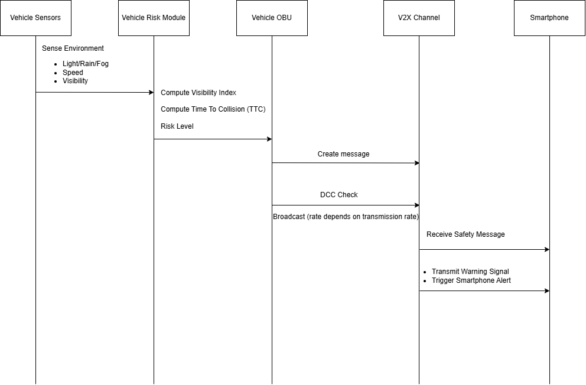

# Adaptive Visibility & Risk Scaling V2P System (AViRS-V2P)

---

# Project Overview

AViRS-V2P (Adaptive Visibility & Risk Scaling Vehicle-to-Pedestrian system) is a context-aware V2P communication system designed to improve pedestrian safety in **low-visibility conditions such as night, heavy rain, and fog**.

Traditional V2P systems typically rely on **fixed time-to-collision (TTC) thresholds and fixed broadcast rates**, which may not provide sufficient warning when environmental visibility deteriorates. At the same time, simply increasing message frequency can lead to **channel congestion and packet collisions** in vehicular networks.

Our proposed system introduces **adaptive communication and risk scaling**, where safety parameters and communication behaviour dynamically adjust based on environmental conditions and vehicle speed. The system computes a **Visibility Index** derived from ambient light levels, rain intensity (estimated through wiper activity), and fog detection from camera-based visibility estimation.

Using this index, AViRS-V2P dynamically adjusts:

* TTC thresholds
* Broadcast frequency
* Safety radius (alert distance)
* Alert intensity

In addition to smartphone-based pedestrian alerts, the system can also support **advanced reflective smart tags**. These wearable tags broadcast a low-power beacon and can receive warning signals from nearby vehicles. When a potential collision is detected, the tag can trigger **vibration or LED alerts** to notify the pedestrian while simultaneously warning the driver. This allows the system to protect pedestrians who may not carry smartphones.

This transforms V2P from a **static warning system into a context-aware, adaptive communication protocol**, allowing safer operation while maintaining network efficiency.

---

# Literature Research

Vehicle-to-Pedestrian (V2P) communication is commonly proposed to protect vulnerable road users (VRUs) by broadcasting a vehicle’s motion state, for example, position, speed, heading, so that a pedestrian device can estimate collision risk. A key finding from the V2P literature is that real-world effectiveness is not determined only by the risk algorithm, but also by system-level constraints such as end-to-end latency, wireless reliability, positioning uncertainty, and scenario diversity, like different VRU types and pre-crash situations. This makes “one fixed rule” , for example a single Time-to-Collision threshold for every environment, difficult to justify across all conditions (Sewalkar & Seitz, 2019). 

From a standards perspective, European Telecommunications Standards Institute (ETSI) VRU awareness work defines a VRU Awareness Basic Service and the VRU Awareness Message (VAM), including rules for when and how VRU-related information should be disseminated and how redundancy can be mitigated to reduce unnecessary channel usage (ETSI, 2025). At the network/access layer, ITS-G5 includes Decentralised Congestion Control (DCC) mechanisms so that stations can adapt transmission behaviour when the radio channel becomes busy, supporting “graceful degradation” rather than allowing uncontrolled beaconing to collapse reliability (ETSI, 2024). ETSI technical studies further emphasise that congestion-control behaviour and stability are critical because poor control can waste channel resources and reduce safety-message delivery when density is high (ETSI, 2026).

Based on these insights, AViRS-V2P contributes a protocol-level adaptation layer that links (1) visibility-aware risk scaling by using a Visibility Index derived from light/rain/fog proxies, (2) adaptive TTC thresholds and adaptive broadcast rates, and (3) DCC-style backoff when the channel is busy. The intent is to provide earlier warnings under poor visibility without relying on “always-on high-rate” transmissions that can increase congestion and reduce overall network reliability. (ETSI, 2025)

Building on this, AViRS-V2P contributes a protocol-level adaptation layer that couples:

1. **Visibility-aware risk scaling** (via a Visibility Index derived from light/rain/fog proxies)
2. **Adaptive TTC thresholds and adaptive broadcast rates**
3. **DCC-style backoff when the channel is busy**

This targets earlier warning under poor visibility without “always-on high-rate” transmissions that can degrade overall network reliability.

---

# 1. System Architecture

## 1.1 Overall Architecture

The AViRS-V2P system consists of two main components:

* **Vehicle Node**
* **Pedestrian Node**, which may use either a smartphone application or an advanced reflective smart tag

---

## 1.2 Architecture Diagram

### Block Diagram


---

### Sequence Flow - Pedestrian (Smartphone)


---

### Sequence Flow - Pedestrian (SmartTags)


## 1.3 Vehicle Side

The vehicle continuously evaluates environmental conditions and computes a dynamic risk level.

### Main Components

* Global Navigation Satellite System receiver / **GNSS receiver** (vehicle position and speed)
* **Ambient light sensor / camera**
* **Rain intensity detection** (wiper speed proxy)
* **Fog or visibility estimator**
* **Risk computation module**
* **Driver alert interface** (dashboard warning / audible alert)
* **V2X On-Board Unit** (DSRC or C-V2X)

The vehicle broadcasts safety messages to nearby pedestrian devices.

---

## 1.4 Pedestrian Side

The pedestrian device may be either a **smartphone application or an advanced reflective smart tag**, both capable of receiving safety alerts and notifying the pedestrian.

### Main Components

For smartphone-based pedestrians:
* **Smartphone GNSS**
* **Inertial sensors** (accelerometer / motion detection)
* **V2P communication receiver**
* **TTC estimation module**
* **Alert engine** (audio / vibration warning)

### Alternative Pedestrian Device: Reflective Smart Tag

The system can also support a **wearable reflective smart tag** designed for pedestrians who may not carry smartphones.

The tag periodically broadcasts a short wireless beacon and can receive warning signals from nearby vehicles. When a collision risk is detected, the tag can trigger **vibration or LED alerts** to warn the pedestrian.

Example attachment locations include:

- white cane (visually impaired pedestrians)
- wheelchair
- children's school bags
- baby strollers
- clothing or jackets
- bicycles or electric scooters

This design improves safety for **vulnerable road users (VRUs)** such as children, elderly pedestrians, and visually impaired individuals.

---

# 2. Functions and Communication Messages

## 2.1 System Functions

### Vehicle Node

* Collect environmental sensor data
* Compute Visibility Index
* Adjust TTC threshold dynamically
* Adjust broadcast frequency
* Broadcast V2P safety message
* Send warning signals to nearby pedestrian devices or smart tags
* Trigger driver warning alerts if collision risk becomes critical

---

### Pedestrian Node

* Receive vehicle message or warning signal
* Estimate relative distance and speed when using the smartphone application
* Compute TTC
* Compare TTC with threshold
* Trigger alert if risk is detected

---

## 2.2 AViRS Safety Message Format

| Field            | Description                             |
| ---------------- | --------------------------------------- |
| Vehicle ID       | Anonymous identifier                    |
| Timestamp        | Message generation time                 |
| Vehicle Position | GNSS latitude & longitude               |
| Vehicle Speed    | Current speed                           |
| Heading          | Vehicle direction                       |
| Visibility Index | Computed environmental visibility score |
| TTC Threshold    | Dynamic collision threshold             |
| Safety Radius    | Maximum alert range                     |
| Risk Level       | Low / Medium / High                     |


For advanced reflective smart tag operation, the vehicle may also transmit a simplified warning signal to trigger vibration or LED alerts on the tag.

---

# 3. Hardware Components and System Parameters

## 3.1 Vehicle Sensors

| Sensor                    | Purpose                             |
| ------------------------- | ----------------------------------- |
| GNSS                      | Vehicle location and speed          |
| Ambient Light Sensor      | Detect night conditions             |
| Rain Sensor / Wiper State | Estimate rain intensity             |
| Camera                    | Detect fog / visibility degradation |
| V2X On-Board Unit         | Wireless V2P communication          |

---

## 3.2 Example System Parameters

| Parameter      | Example Value |
| -------------- | ------------- |
| Default TTC    | 2 seconds     |
| Maximum TTC    | 4 seconds     |
| Broadcast Rate | 1–10 Hz       |
| Safety Radius  | 30–90 m       |
| Message Size   | ~200 bytes    |
| Target Latency | <100 ms       |

---

## 3.3 Environmental Parameter Ranges

| Parameter           | Measurement Unit | Example Range |
| ------------------- | ---------------- | ------------- |
| Ambient Light       | lux              | 0 – 10000     |
| Rain Intensity      | mm/hour          | 0 – 10+       |
| Visibility Distance | meters           | 20 – 200+     |

---

# 4. Adaptive Risk Scaling Model

## 4.1 Visibility Index (Normalized)

We normalize each factor to **[0,1]**:

* **L** = normalized ambient light (0 = dark, 1 = bright)
* **R** = normalized rain intensity (0 = none, 1 = heavy)
* **F** = normalized fog level (0 = clear, 1 = dense)

### Visibility Index Formula

```math
V = w_L L + w_R (1 - R) + w_F (1 - F)
```

```math
V∈[0,1]
```

Risk scaling factor:

```math
S = 1 - V
```

Lower visibility results in higher risk scaling.

### Example Weighting Factors

* wL = **0.4** (ambient light importance)
* wR = **0.35** (rain impact)
* wF = **0.25** (fog impact)

The weights can be calibrated using experimental data or simulation in future implementations.

---

## 4.2 Environmental Parameter Normalization

Environmental parameters are normalized so that measurements with different physical units can be combined into a single equation.

---

### 4.2.1 Ambient Light (L)

| Condition       | Light Level | Normalized L |
| --------------- | ----------- | ------------ |
| Bright daylight | >1000 lux   | 1.0          |
| Cloudy daylight | 200–500 lux | 0.8          |
| Street lighting | 10–50 lux   | 0.3          |
| Dark rural road | <5 lux      | 0.1          |

Lower light levels correspond to poorer visibility.

---

### 4.2.2 Rain Intensity (R)

| Wiper Speed   | Estimated Rain Intensity | Normalized R |
| ------------- | ------------------------ | ------------ |
| Off           | No rain                  | 0.0          |
| Intermittent  | Light rain               | 0.3          |
| Medium speed  | Moderate rain            | 0.6          |
| Maximum speed | Heavy rain               | 1.0          |

Higher rain intensity increases visual obstruction.

---

### 4.2.3 Fog Level (F)

| Visibility Distance | Fog Condition | Normalized F |
| ------------------- | ------------- | ------------ |
| >200 m              | Clear         | 0.0          |
| 100–200 m           | Light fog     | 0.3          |
| 50–100 m            | Moderate fog  | 0.6          |
| <50 m               | Dense fog     | 1.0          |

Lower visibility distances correspond to higher fog levels.

---

## 4.3 Adaptive TTC Threshold

| Condition    | TTC Threshold | Broadcast Rate |
| ------------ | ------------- | -------------- |
| Clear Day    | 2.0 s         | 1 Hz           |
| Night        | 3.0 s         | 5 Hz           |
| Heavy Rain   | 3.5 s         | 8 Hz           |
| Night + Rain | 4.0 s         | 10 Hz          |

This allows the system to increase safety margins during poor visibility.

---

# 5. Use Case Scenario

A vehicle travels at **60 km/h at night during heavy rain**. Environmental sensors detect low ambient light and high rain intensity, resulting in a low Visibility Index.

The AViRS-V2P system increases the TTC threshold from **2 seconds to 4 seconds** and raises the broadcast rate to **10 Hz** to improve detection reliability.

A pedestrian approaching a crossing receives the V2P message through their smartphone. The system calculates the relative trajectory and determines that the TTC falls below the adaptive threshold.

The pedestrian device immediately triggers a **vibration and audio alert**, allowing the pedestrian to stop before entering the vehicle’s path.

At the same time, the vehicle can also issue a **driver warning alert**, such as a dashboard notification or audible warning, when the TTC falls below the adaptive threshold. This provides an additional safety layer in case the pedestrian does not react immediately.

This adaptive approach provides earlier warnings compared to traditional fixed-threshold V2P systems.

---

## 5.1 System Limitations and Fallback Scenarios

While AViRS-V2P improves pedestrian awareness and collision warning capability, certain real-world situations may limit the effectiveness of the system.

### Pedestrian Without a Smartphone

If a pedestrian does not carry a smartphone, they may still be supported through a compatible advanced reflective smart tag. However, if the pedestrian carries neither a smartphone nor a compatible tag, the pedestrian will not receive the safety message directly. In this case, the system can still improve safety indirectly because the vehicle may trigger **driver alerts or advanced driver assistance systems**, such as visual warnings or automatic emergency braking (AEB), when the predicted TTC falls below the safety threshold. AViRS-V2P therefore acts as an **additional safety layer** rather than replacing existing vehicle safety mechanisms.

### Vehicle Communication or Sensor Failure

If the vehicle’s V2X communication module or sensors malfunction, the system may not be able to broadcast safety messages correctly. In such situations, the vehicle would rely on **conventional onboard safety systems**, such as camera-based pedestrian detection or driver awareness, to maintain safety.

### Communication Interference

Wireless V2P communication may occasionally experience **packet loss, interference, or channel congestion**, especially in dense traffic environments. To mitigate this issue, AViRS-V2P incorporates **adaptive broadcast rates and congestion-aware behavior**, allowing the system to reduce transmission frequency when the communication channel becomes busy.

### GNSS Positioning Uncertainty

V2P systems rely on GNSS positioning to estimate distance and trajectory between the vehicle and pedestrian. However, GNSS signals can experience **positioning errors due to urban buildings, signal blockage, or multipath reflections**. AViRS-V2P addresses this by using a **safety radius and TTC threshold margin**, ensuring that small positioning inaccuracies do not significantly affect the warning decision.

These considerations highlight that AViRS-V2P is designed to **complement existing vehicle safety systems while improving pedestrian awareness in low-visibility environments**.

---

## 5.2 Accessibility Considerations

AViRS-V2P is designed to support different types of pedestrians, including those with visual or hearing impairments.

### Support for Visually Impaired Pedestrians

For visually impaired pedestrians, the smartphone application can provide **audio-based warnings** using voice prompts or audible alerts. When the system detects that the TTC falls below the safety threshold, the device can announce warnings such as:

- “Warning: Vehicle approaching”
- “Do not cross”

These voice alerts allow visually impaired users to receive clear guidance even when they cannot see the vehicle.

### Support for Hearing-Impaired Pedestrians

For pedestrians who are deaf or hard of hearing, the system can provide **strong vibration alerts and visual notifications** on the smartphone screen. These alerts ensure that users who cannot hear audible warnings can still detect the approaching vehicle through tactile or visual feedback.

### Multi-Modal Alert Design

To improve accessibility, AViRS-V2P supports **multi-modal alerts**, including:

- Audio alerts
- Vibration alerts
- Visual notifications

This approach ensures that the system remains usable by a wide range of pedestrians with different accessibility needs.

---

## 5.3 Smart Tag Assisted Pedestrian Protection

In addition to smartphones, AViRS-V2P can support **advanced reflective smart tags** that communicate directly with vehicles.

For example, a visually impaired pedestrian may carry a smart tag attached to their cane or jacket. The tag periodically broadcasts a low-power beacon that is detected by nearby vehicles. When the vehicle's risk computation module predicts a low TTC value, the vehicle sends a warning signal back to the tag.

The tag then triggers **vibration or flashing LED alerts**, while the vehicle simultaneously issues a **driver warning notification**. This two-way alert system improves safety for pedestrians who may not carry smartphones, such as children, elderly pedestrians, or wheelchair users.

---

# 6. Decision Log

*(Chronological record of design decisions)*

| Date  | Trigger                    | Options                         | Criteria           | Decision              | AI Usage         | Team Member |
| ----- | -------------------------- | ------------------------------- | ------------------ | --------------------- | ---------------- | ----------- |
| **05/03/2026** | **Brainstorming Ideas** for the AViRS-V2P project to improve pedestrian safety in low-visibility conditions (night, rain, fog). Initial discussion included features like night visibility assist, pedestrian protection, and smart alerts. | 1. Focus on improving **visibility** for pedestrians. 2. Explore solutions for **non-smartphone users** (e.g., visually impaired, elderly). 3. Integrate **smart alerts**. | 1) Pedestrian safety impact 2) Feasibility 3) Accessibility for non-smartphone users | The team brainstormed different solutions and focused on **Night Visibility Assist** for pedestrians. The inclusion of **smart tags** for non-smartphone users (e.g., visually impaired, elderly, children) was added to the system after discussions. | AI tools were used to generate initial design ideas and explore different use cases for pedestrian protection. | Whole team members and AI tools in ideation. |
| **06/03/2026** | **Professor's Suggestion:** Consider pedestrians who do not carry smartphones. | 1. Keep the current smartphone-based notification system. 2. Add **advanced reflective smart tags** that notify both pedestrians and drivers. | 1) User accessibility 2) Communication reliability 3) Effectiveness in non-smartphone scenarios | The team decided to integrate **advanced reflective smart tags** for pedestrians who may not carry smartphones. These tags provide two-way notifications between pedestrians and vehicles. They can be attached to items like canes, wheelchairs, and bags. | AI suggested design options for integrating the tags into everyday items and for optimizing communication systems. | Whole team members with professor’s feedback. |
| **10/03/2026** | **Smart Tag Design:** Refining the design of **reflective smart tags** and their attachment methods for different pedestrian devices. | 1. Create compact, attachable tags for easy use. 2. Optimize the **battery life** and **signal range** of the tags. | 1) Size 2) Power efficiency 3) Signal range | The team proceeded with designing **small, attachable smart tags** that can be used on items like canes, wheelchairs, strollers, and bags. Focus was placed on **power efficiency** and **signal range** to ensure proper functionality in different scenarios. | AI was used for refining power consumption models and generating tag design options. | Chor Yi |
| **12/03/2026** | **Advanced Reflective Smart Tags:** Refining the smart tag design and its attachment to everyday items like canes, strollers, and wheelchairs. | 1. Attach the smart tags to everyday items such as canes, wheelchairs, and strollers. 2. Evaluate tag size, attachment options, and user feedback. | 1) Size and comfort 2) Signal effectiveness 3) Battery life | The team decided to proceed with **compact, attachable smart tags** for items like canes, strollers, and wheelchairs. Focus was placed on **user comfort** and ensuring that the tags were not intrusive to pedestrians. | AI helped simulate different attachment methods and optimize the tag's functionality. | Sylvia |
| **15/03/2026** | **Adding Intent-Aware Smart Crossing:** The vehicle should detect pedestrian intent and adjust speed accordingly. | 1. Integrate a **smart crossing system** where vehicles detect pedestrian intent and react. | 1) Pedestrian and driver interaction 2) System responsiveness | The team decided to develop an **Intent-Aware Smart Crossing** system. Vehicles will be able to detect pedestrians' intent to cross the road and slow down or stop, improving pedestrian safety in low-visibility situations. | AI was used to simulate pedestrian intent and vehicle response algorithms. | Shirin |
| **18/03/2026** | **Dynamic Safety Aura:** Adjust pedestrian safety zones based on real-time traffic conditions. | 1. Add a **Dynamic Safety Aura** that adjusts safety zones based on pedestrian proximity and traffic density. | 1) Network efficiency 2) Pedestrian proximity 3) Traffic analysis | The team decided to add a **Dynamic Safety Aura** that adjusts safety zones for pedestrians based on traffic conditions and pedestrian proximity. This provides enhanced safety during heavy traffic. | AI assisted in traffic analysis and predicting pedestrian movements to refine safety zone adjustments. | Fatin |
| **20/03/2026** | **Cyclist Protection:** Ensuring cyclist safety by integrating blind spot sensors into the vehicle communication system. | 1. Add **blind spot detection** sensors for cyclists. 2. Integrate sensors with vehicle communication systems to improve cyclist awareness. | 1) Cyclist safety 2) Vehicle sensor integration | The team decided to **integrate blind spot sensors** for cyclists, alerting both cyclists and drivers when a vehicle is approaching from behind. This is crucial for improving safety during vehicle-pedestrian interactions. | AI helped simulate the blind spot detection system and assess cyclist movements. | Jiayi |
| **25/03/2026** | **Final Integration and Design Refinement:** Final integration of **smart tags, intent-aware crossing, blind spot detection**, and other system features. | 1. Complete **system design** for large-scale deployment. 2. Ensure all system components are ready for final validation and deployment. | 1) Design consistency 2) System readiness for deployment | The team finalized the design of all components and integrated them into the AViRS-V2P system. All features, such as the smart tags, crossing system, and cyclist detection, were fully designed and ready for validation. | AI tools assisted in the final validation of system design and optimizing communication protocols. | Whole team members |

---

### Key Features and Decisions:

- **Night Visibility Assist:** Designed to enhance pedestrian safety in low-visibility conditions.
  
- **Advanced Reflective Smart Tags:** Integrated to assist pedestrians who do not carry smartphones, improving accessibility for those with visual impairments, elderly, children, etc. These tags provide two-way communication between pedestrians and vehicles.

- **Intent-Aware Smart Crossing:** Vehicles will detect pedestrian intent and adjust speed accordingly, providing additional safety during crossings.

- **Dynamic Safety Aura:** Adjusts pedestrian safety zones based on real-time traffic conditions and pedestrian proximity, ensuring safe interaction in dense traffic.

- **Cyclist Blind Spot Protection:** Sensors detect cyclists in the vehicle’s blind spot and alert both the cyclist and the driver, improving overall safety.

# 7. AI Usage and Reflection

## 7.1 AI Tools Used

* **ChatGPT** – concept ideation and documentation

---

## 7.2 Example Prompts Used

**Example prompt 1**

> "Suggest a novel V2P application with adaptive communication for vehicular networks."

**Example prompt 2**

> "Generate a V2P message structure including TTC and visibility parameters."

**Example prompt 3**

> "Provide pseudocode for adaptive TTC calculation."

---

## 7.3 AI Limitations Identified

1. AI suggested unrealistic hardware sensors that were replaced with practical alternatives.
2. Some generated parameter values were unrealistic and were manually verified.
3. AI occasionally produced overly complex message formats that required simplification.

---

## 7.4 Individual Reflection

Each team member will include a short reflection describing:

* Their contribution to the project
* How AI tools assisted their work
* How results were verified and improved

---

## Fatin Farahin (2303542)

I mainly worked on the system architecture and overall structure of the project documentation. My first step was reviewing the project requirements and identifying how the system components should be organized in the README so that the design could be explained clearly. I then helped in designing the architecture and sequence diagrams by mapping out the interaction between the vehicle node, pedestrian device, and communication system. To do this, I first sketched a simple flow of how data should move through the system and then refined it into the final diagrams used in the repository.

I also used AI tools during the early design stage to generate possible architecture layouts, but many of the suggestions included unnecessary components or unrealistic communication steps. Because of that, I simplified the design and aligned it with concepts we learned in the vehicular networks lectures. I also cross-checked the architecture to ensure that the sensors, V2X communication module, and alert systems were logically connected. This process helped me better understand how different subsystems integrate within a V2P safety application.

## Loong Chor Yi (2302793)

My main responsibility was developing the adaptive risk scaling model and the Visibility Index calculation used in the AViRS-V2P system. I began by identifying which environmental factors significantly affect visibility and pedestrian detection, such as ambient light, rain intensity, and fog conditions. I then explored how these different parameters could be combined into a single metric that represents environmental visibility. To achieve this, a normalized model was created where each parameter is scaled between 0 and 1 so they can be combined in a weighted formula.

AI tools were used to generate some initial equation ideas, but the outputs sometimes lacked clear reasoning or used unrealistic parameter ranges. Therefore, I adjusted the formula and defined the weighting factors so that they better reflect real-world driving conditions. I also created the tables showing how environmental measurements are converted into normalized values. Through this process, I learnt how mathematical models can be used to adapt safety thresholds dynamically based on environmental conditions.

## Shirin Nadia (2302871)

My main role was working on the functions of the system and the design of the communication messages between vehicles and pedestrian devices. My approach was to first identify what information a pedestrian device would need in order to estimate collision risk. Based on that, I designed the message structure that includes fields such as vehicle position, speed, heading, visibility index, and TTC threshold. I also helped define the system functions for both the vehicle node and the pedestrian node, describing how each component processes the information it receives.

I used AI tools to generate example V2P message structures, but many of the suggestions included unnecessary data fields that would increase message size and network load. Therefore, I simplified the message format and focused on the most essential information needed for risk estimation. I also worked on selecting realistic communication parameters such as broadcast rates and latency requirements. This helped ensure that the proposed system remains feasible within vehicular network constraints.

## Sylvia Goh Wen Wen (2302759)

My main role was conducting the literature research and connecting existing studies to our proposed system design. I started by reviewing research papers and standards related to Vehicle-to-Pedestrian communication and vulnerable road user safety. From these sources, I identified key limitations in current systems, such as the use of fixed TTC thresholds and challenges related to communication congestion. I then summarized these findings and explained how our proposed AViRS-V2P system addresses some of these issues through adaptive communication and visibility-based risk scaling.

I found AI tools to be helpful in refining the wording and structure of the explanations while drafting this section. They assisted in suggesting clearer ways to present technical ideas and improving the flow of the discussion. I also made sure that the literature discussion clearly supported the motivation behind our AViRS-V2P design. This process helped me better understand how existing studies and standards influence the development of practical vehicular safety systems.

## Zhang Jia Yi (2302757)

I mainly worked on the use case scenario, system limitations, and accessibility considerations sections of the project. My goal was to explain how the AViRS-V2P system would operate in realistic situations and how it could benefit different types of pedestrians. I began by analysing typical road scenarios where poor visibility increases accident risk, such as driving at night during heavy rain. Based on these scenarios, I created the example use case to illustrate how the system adapts the TTC threshold and broadcast rate in response to environmental conditions. I also considered potential real-world limitations, including communication interference and situations where pedestrians do not carry smartphones.

AI tools were useful for suggesting example scenarios, but many of them were overly complex or unrealistic, so I simplified them to better match practical situations. I then expanded the accessibility section to describe how different alert modes such as vibration, audio, and visual notifications can support pedestrians with different needs. This helped ensure that the system design considers inclusivity as well as safety.
